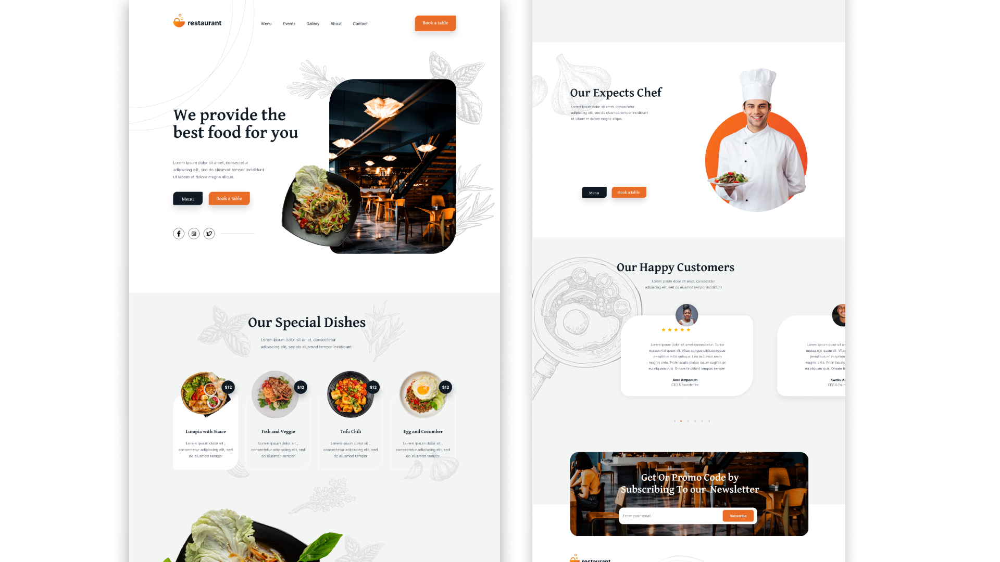

# 🍽️ Restaurant Landing Page  

> A stylish restaurant landing page built with **HTML & CSS** (No JavaScript). Based on a Figma design by **Issac Donvoh**.  

  

## 🚀 Live Demo  
🔗 [View Project](https://lexp2204.github.io/Restaurant-Landing-Page/) *(If deployed, otherwise remove this section.)*  

---

## 📌 Features  
✅ Fully static restaurant landing page  
✅ Modern & clean design  
✅ Based on a Figma Community design  
✅ Well-structured and semantic HTML & CSS  
✅ Easy to customize  

---

## 🛠️ Technologies Used  
- HTML5  
- CSS3  
- Figma for design reference  

---

## 📈 Future Improvements  
🔹 Make the page **fully responsive**  
🔹 Add **animations & transitions**  
🔹 Improve **accessibility & SEO**  

---

## 📄 Credits  
🎨 **Design by:** [Issac Donvoh](https://www.figma.com/community/file/1173601241909576521/restaurant-website-landing-page-design)  
💻 **Developed by:** [Me](https://github.com/lexp2204)  

---

## 🌟 Show Your Support  
⭐ If you like this project, **give it a star** on GitHub!  
